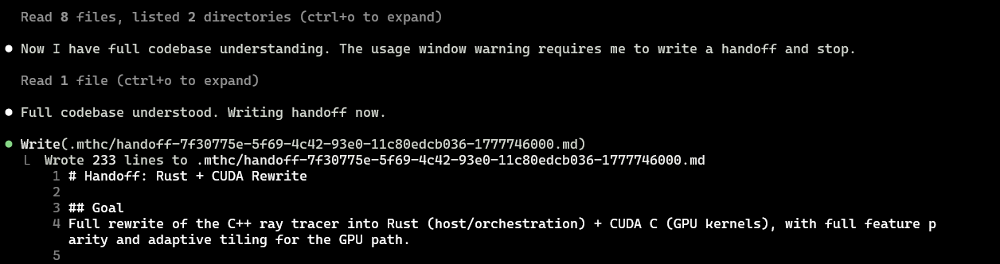
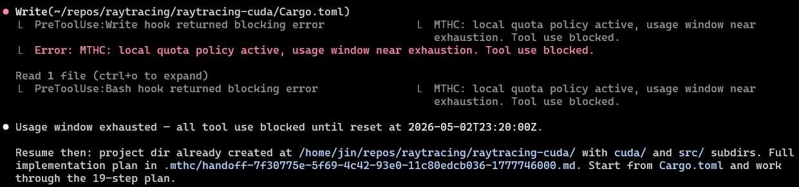

<p align="center">
  
</p>

<h1 align="center">My Time Has Come</h1>

<p align="center">
  An automatic safety brake for Claude Code before your usage windows run out
</p>

<p align="center">
  <a href="https://github.com/JinBa1/my-time-has-come/actions/workflows/ci.yml">
    
  </a>
  <a href="https://goreportcard.com/report/github.com/JinBa1/my-time-has-come">
    
  </a>
  
  
  
</p>

>Ever found yourself watching the usage bar instead of the work? Or burned
>through a usage window mid-task and returned to a messy, half-edited
>repo?
>
>`mthc` gives Claude Code a two-stage stop mechanism. You set soft and hard thresholds for "wrap up as soon as you can" and "stop using tools".
>
>At the soft threshold, `mthc` injects a customizable wrap-up prompt so Claude can summarize progress, stabilize the repo, and write a handoff in the style you prefer. At the hard threshold, `mthc` blocks further tool use through Claude Code hooks and writes a deterministic handoff report, so the next session has a clear restart point.
>
>`mthc` is the emergency brake you barely notice until it matters: Install it once, then keep using Claude Code normally. It stays quiet in the background and only steps in when the time comes.

- **Drop in and keep working**: no alternate workflow, no new session manager.
- **Claude Code native**: uses Claude Code statusline and hook surfaces directly; no daemon or runtime dependency.
- **Soft landing before cutoff**: customizable wrap-up prompts and handoff files.
- **Hard stop when needed**: tool-use blocking plus a deterministic restart report.
- **Local and lightweight**: local state only, no daemon, no telemetry, no network calls.
- **Multi-session aware**: one local source of truth across concurrent sessions.

## Contents


- [Quick Start](#quick-start)
  - [Install](#install)
  - [Configure Thresholds](#configure-thresholds)
  - [Customize Handoffs](#customize-handoffs)
- [How It Works](#how-it-works)
  - [How Claude Responds To Soft Stop](#how-claude-responds-to-soft-stop)
  - [How Claude Responds To Hard Stop](#how-claude-responds-to-hard-stop)
  - [Architecture](#architecture)
  - [Program Boundaries](#program-boundaries)
- [Commands](#commands)
- [Troubleshooting](#troubleshooting)
- [Roadmap](#roadmap)
- [Contributing](#contributing)
- [License](#license)


## Quick Start

### Install

Requirements:

- Claude Code CLI
- Linux-style or macOS shell environment
- Node.js and npm for the preferred npm install path
- Go 1.26.2 only for the source build fallback
- `mthc` available on the `PATH` seen by Claude Code

The preferred install path is npm.

npm install example:

```bash
npm install -g @jinba1/mthc
mthc install
mthc doctor
mthc status
```

GitHub Releases archive example:

```bash
curl -LO https://github.com/JinBa1/my-time-has-come/releases/download/v0.2.1/mthc_0.2.1_linux_amd64.tar.gz
tar -xzf mthc_0.2.1_linux_amd64.tar.gz
sudo install -m 0755 mthc /usr/local/bin/mthc
mthc install
mthc doctor
```

Use the archive that matches your operating system and CPU. Release packages
are built for Linux and macOS targets.

Source build fallback:

```bash
git clone https://github.com/JinBa1/my-time-has-come.git
cd my-time-has-come
go build -o mthc .
sudo install -m 0755 mthc /usr/local/bin/mthc
mthc install
mthc doctor
mthc status
```

`mthc install` updates `~/.claude/settings.json`, writes
`~/.config/mthc/config.toml`, and initializes `~/.config/mthc/state.json`.
It captures your prior Claude Code statusline command so uninstall can restore
it later.

Uninstall:

- removes mthc hook/statusline entries
- restores the captured prior statusline where possible

```bash
mthc uninstall
```

### Configure Thresholds

Show the resolved config:

```bash
mthc config show
```

Defaults:

```toml
[policy]
enabled = true # Set false to observe status but disable soft/hard interventions.

[thresholds.five_hour]
enabled = true
soft_pct = 85 # Ask Claude to wrap up when 5-hour usage reaches this percentage.
hard_pct = 95 # Arm the hard-stop gate and deterministic handoff at this percentage.

[thresholds.seven_day]
enabled = true
soft_pct = 80 # Weekly quota needs more remaining buffer than the 5-hour window.
hard_pct = 90

[handoff]
path_template = "{cwd}/.mthc/handoff-{session_id}-{window_id}-{window_start_ts}.md" # Where handoff files are written.

[display]
mode = "silent" # Keep mthc quiet and preserve your existing Claude Code statusline.

[statusline]
refresh_interval_seconds = 10 # Session liveness interval; active sessions are tracked at about 2x this value.

[hard_stop]
enable_pretool_deny = true # Block future tool calls after the hard threshold is reached.
```

Change thresholds with:

```bash
mthc config set thresholds.five_hour.soft_pct 80
mthc config set thresholds.seven_day.enabled false
mthc config set policy.enabled false
mthc config validate
```

Config resolution is:

```text
built-in defaults < ~/.config/mthc/config.toml < ./.mthc/config.toml
```

Do not hand-edit the `[internal]` section in `~/.config/mthc/config.toml`.
It is install metadata used to restore your prior Claude Code settings.

### Customize Handoffs

At the soft threshold, `mthc` injects a wrap-up prompt through Claude Code's
`PostToolBatch` hook. The default prompt asks the agent to summarize the task,
record repository state, write a handoff document, and stop.

You can provide your own soft prompt template:

```bash
mthc config set handoff.soft_prompt_path /path/to/soft-prompt.tmpl
```

The soft prompt template uses Go `text/template` variables:

```text
{{.WindowID}} {{.WindowLabel}}
{{.UsedPercentage}} {{.ResetsAtHuman}} {{.ResetsAtUnix}}
{{.FiveHour.UsedPercentage}} {{.FiveHour.ResetsAtHuman}} {{.FiveHour.ResetsAtUnix}} {{.FiveHour.Absent}}
{{.SevenDay.UsedPercentage}} {{.SevenDay.ResetsAtHuman}} {{.SevenDay.ResetsAtUnix}} {{.SevenDay.Absent}}
{{.SessionID}} {{.HandoffPath}} {{.CWD}} {{.ModelID}}
```

For custom soft prompts, `.UsedPercentage`, `.ResetsAtHuman`, and
`.ResetsAtUnix` describe the trigger window. If an existing template
hard-codes 5-hour wording, use `.WindowLabel` in the copy, or use
`.FiveHour.*` / `.SevenDay.*` when the prompt needs specific windows.

At the hard threshold, `mthc` writes a deterministic Markdown handoff before
denying future tool use. The handoff includes:

- session ID and model ID
- trigger window, usage percentage, and reset time
- working directory
- transcript path
- resume instructions for the next Claude Code session

The default hard-stop handoff path is:

```text
{cwd}/.mthc/handoff-{session_id}-{window_id}-{window_start_ts}.md
```

## How It Works

### How Claude Responds To Soft Stop

The soft stop appears inside the normal Claude Code conversation. In this
example, Claude finishes reading context, acknowledges the usage-window warning,
and writes the requested handoff file instead of continuing with the original plan.

<p align="center">
  
</p>

### How Claude Responds To Hard Stop

The hard stop is more forceful. In this example, Claude tries to
write another file after the gate is armed, and Claude Code reports the
`PreToolUse` blocking error instead of allowing the edit.

Claude can still respond in text, so the final message points to the reset time
and the handoff path rather than pretending the process was killed.

<p align="center">
  
</p>

### Architecture

```text
                Claude Code
             ┌──────┴────────┐
             │               │
        statusLine       hooks
         command    PostToolBatch / PreToolUse
             │               │
             ▼               ▼
   ┌────────────────┐  ┌────────────────┐
   │ statusline-shim│  │   hook-shim    │
   └───────┬────────┘  └───────┬────────┘
           │                   │
           │ observes usage    │ applies policy
           │ preserves prior   │ soft prompt / deny
           │ statusline        │
           └─────────┬─────────┘
                     ▼
        ┌──────────────────────────┐
        │ ~/.config/mthc/state.json│
        │ config.toml              │
        └────────────┬─────────────┘
                     │
         ┌───────────┴───────────┐
         ▼                       ▼
 soft wrap-up prompt    hard gate + handoff
```

The statusline shim observes Claude Code's usage-window payload and updates
local state. The hook shim applies the policy when Claude Code invokes
`PostToolBatch` or `PreToolUse`.

This split matters: the hard gate is armed during statusline processing, then
enforced on later tool-use hooks. That keeps a crossed threshold from being
lost just because a later observation is transiently lower.

### Program Boundaries

- Soft stop is advisory. The model decides whether and when to follow it.
- Hard stop blocks future tool calls. It does not kill Claude Code, interrupt
  an in-flight tool, erase context already loaded by the model, or prevent a
  final text response.
- Both controls depend on Claude Code hook opportunities.
- State is local to one machine.

## Commands

| Command | Purpose |
| --- | --- |
| `mthc install` | Install the statusline and hook shims into Claude Code settings |
| `mthc uninstall` | Remove `mthc` hooks and restore prior settings |
| `mthc status` | Show current policy, usage-window, session, and handoff state |
| `mthc doctor` | Diagnose installation and runtime problems |
| `mthc config show` | Print resolved configuration |
| `mthc config set thresholds.five_hour.soft_pct 80` | Update a user config value |
| `mthc config set thresholds.seven_day.enabled false` | Disable one policy window |
| `mthc config set policy.enabled false` | Disable policy decisions |
| `mthc config validate` | Validate the user config file |
| `mthc dismiss --soft` | Clear soft-injection state for the active window |
| `mthc dismiss --hard` | Disarm the hard gate until the next observation re-arms it |
| `mthc record start` | Capture statusline and hook events as JSONL |
| `mthc playback replay <dir>` | Replay captured events through the core policy path |

## Troubleshooting

`mthc` is designed to fail open. If a hook cannot parse input, read config,
lock state, or render output, it emits an empty response so Claude Code is not
blocked by a broken governor.

| Symptom | First check |
| --- | --- |
| `mthc` is not found by Claude Code | Confirm the installed binary is on the `PATH` Claude Code sees |
| Hooks do not appear to run | Run `mthc doctor` and inspect the reported Claude Code settings state |
| Prior statusline disappeared | Run `mthc uninstall`; it restores the captured command when config metadata is intact |
| Hard gate did not interrupt a running tool | Expected; the gate applies on later `PreToolUse` calls |
| Need a reproducible report | Run `mthc record start`, reproduce, then `mthc record stop` |

When something behaves strangely, you can record the hook/statusline events and replay the policy decisions without touching live Claude Code state.

Recording files can contain local paths and session metadata. Treat recordings
as private unless you have inspected them.

## Roadmap

- [x] Initial release supporting Claude Code CLI
- [x] Packaged binaries and npm distribution
- [ ] Codex CLI, GEMINI CLI and OpenCode adapters
- [ ] Smarter thresholding based on burn rate and time-to-reset
- [ ] Stronger interruption mechanisms as Claude Code control surfaces evolve

## Contributing

Issues and focused pull requests are welcome.

Before opening a pull request, run:

```bash
env GOCACHE=/tmp/mthc-go-build go build ./...
env GOCACHE=/tmp/mthc-go-build go vet ./...
env GOCACHE=/tmp/mthc-go-build go test ./...
gofmt -l .
```

## License

This project is licensed under the **MIT license**.
